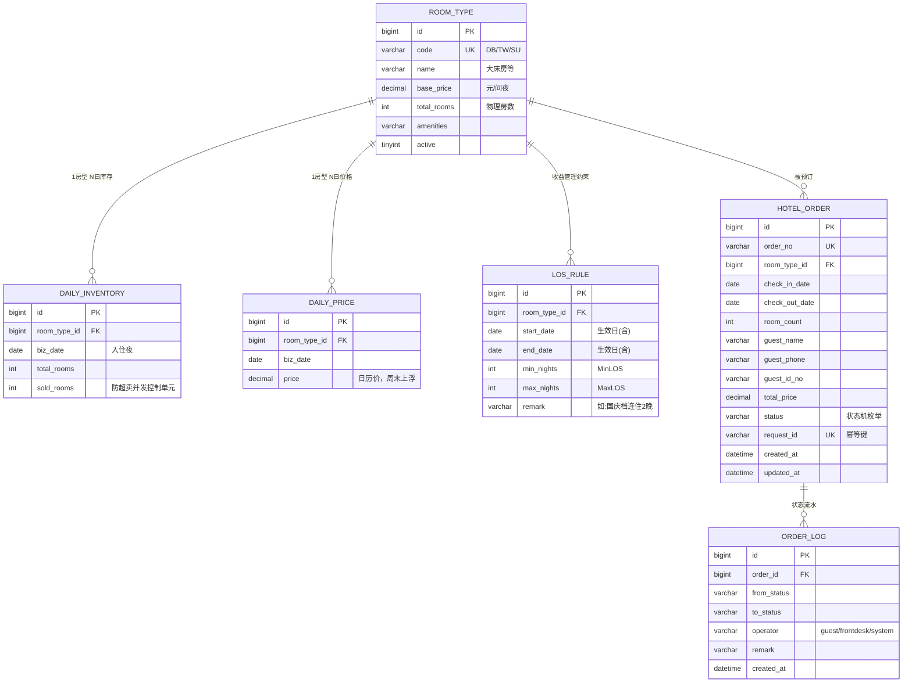

# 02 技术方案

## 1. 架构总览

```
┌────────────────────────────────────────────────────────────────┐
│  前端静态 SPA（Spring Boot 直出 /static，零构建零 CDN）            │
│  #/booking 预订  |  #/orders 订单查询  |  #/frontdesk 前台管理     │
└──────────────────────────────┬─────────────────────────────────┘
                        REST /api/**（JSON）
┌──────────────────────────────▼─────────────────────────────────┐
│  Controller 层  参数校验(javax.validation) → 统一响应/异常处理     │
├─────────────────────────────────────────────────────────────────┤
│  Service 层（应用服务，事务边界）                                   │
│  BookingService(下单编排) OrderService(状态流转)                   │
│  AvailabilityService(房态) FrontDeskService(统计)                 │
├─────────────────────────────────────────────────────────────────┤
│  Domain 层（纯领域逻辑，无 IO，可独立单测）                          │
│  OrderStatus 状态机 · DateRules 日期规则 · PricingPolicy 计价策略   │
├─────────────────────────────────────────────────────────────────┤
│  Mapper 层（MyBatis-Plus + XML）                                  │
│  库存 FOR UPDATE 行锁 SQL · 订单行锁 SQL · 常规 CRUD                │
├─────────────────────────────────────────────────────────────────┤
│  存储：H2 文件库(MODE=MySQL，演示默认) ⇄ MySQL 8（生产 profile）     │
└─────────────────────────────────────────────────────────────────┘
依赖方向：Controller → Service → Domain ← Mapper（领域不依赖基础设施）
```

## 2. 技术选型与理由（含答辩口径）

| 选型 | 版本 | 理由 |
|---|---|---|
| Java | 8 | **匹配目标企业（华住）存量体系**；本机原生 JDK8 现场演示零安装 |
| Spring Boot | 2.7.18 | 2.x 线最终稳定版，Java 8 生态"成熟框架"的字面最优解 |
| MyBatis-Plus | 3.5.7 | 阿里系主流 ORM；`SELECT ... FOR UPDATE` 显式可控，并发方案在面试中讲得清 |
| H2 | 2.1（MODE=MySQL） | 演示零外部依赖；与 MySQL 同 SQL、同 FOR UPDATE 语义 |
| MySQL | 8.0（profile 可选） | 生产配置就绪 + docker-compose，切换只改启动参数 |
| springdoc-openapi | 1.7 | Swagger UI 现场展示 API 契约 |
| JUnit 5 | — | 30 个用例含并发防超卖 |
| 前端 | 静态 SPA | 无构建/无 CDN，现场无外网也不翻车；生产演进 Vue3 |

**"为什么 Java 8 / Boot 2.7"的标准答辩**：① 匹配目标企业存量技术栈，面试官零心智负担；② Boot 2.7 社区支持已结束这一点是**知情决策**——代码刻意保持迁移友好（领域逻辑与框架解耦、包结构按域切分、未用 Boot 2 特有 API），升级 Java 17 + Boot 3 只需换 starter 与 `javax→jakarta` 命名空间；③ 本题的技术亮点（事务、状态机、幂等）与语言版本无关。

## 3. 领域建模（核心决策）

### 3.1 数据模型（ER 图）



> GitHub 直接渲染 Mermaid。唯一约束：`DAILY_INVENTORY(room_type_id, biz_date)`、`DAILY_PRICE(room_type_id, biz_date)`、`HOTEL_ORDER(order_no)`、`HOTEL_ORDER(request_id)`。

### 3.2 关键建模决策

1. **库存粒度 = 房型 × 日期**（而非"房型总房间数"）：酒店卖的是"某晚某房型"的可售量，这是防超卖正确性的前提，也是并发控制的加锁单元
2. **下单即占房**：订单创建即扣减库存（含待支付），取消/支付超时释放——与 OTA 预售模式一致，避免"支付成功才发现没房"
3. **金额用 DECIMAL**：全程 BigDecimal，禁止浮点参与金额运算
4. **房型与商品的关系（诚实标注）**：严格模型中"商品（Product/Sellable Unit）= 房型 × 房价码（RatePlan）"——房型是物理资源概念（库存归属），价格/上下架等销售属性属于商品层。本系统为单房价码简化，房型与商品一对一退化，`room_type` 同时承载物理与销售属性（见 RoomType 实体注释）。多房价码演进：新增 `product` 表（room_type_id + rate_plan_id），销售属性迁至 product/rate_plan，房型回归纯物理资源定义。

### 3.3 LOS 收益管理约束（Length Of Stay）

酒店收益管理（Revenue Management）的核心概念：**按"房型 × 日期段"限制连住晚数**，与 Daily 库存/价格是正交的两个维度。

| 概念 | 语义 | 示例 |
|---|---|---|
| MinLOS | 最少连住晚数 | 国庆档最少连住 3 晚——防止 1 晚散单占据稀缺房晚 |
| MaxLOS | 最长连住晚数 | 旺季限制长住，保住高客单价的短住流量 |
| CTA / CTD（同族，预留） | 禁止某日入住 / 禁止某日离店 | 大型展会首日只出不进等精细化管控 |

**分层设计**（对应真实系统的房价码/RatePlan 维度）：

- 库存保持 **Daily 粒度**（`daily_inventory`）不变；
- `los_rule(room_type_id, start_date, end_date, min_nights, max_nights)` 作为**约束层**叠加其上；
- 入住区间与任一规则日期段**重叠**即生效，多规则重叠取**最保守并集**（min 取最大、max 取最小）；
- 下单时在**锁库存之前**校验（快速失败），违反返回 `LOS_MIN_NOT_MET` / `LOS_MAX_EXCEEDED`（400）；
- 房态接口透出 `minLosNights`，前端可提前告知客人"该日期需连住 N 晚"；
- 演示种子：大床房未来第 8~10 天"周末档最少连住 2 晚"，现场可演示拒单与放行。

> **行业对照（诚实标注，避免被追问时失分）**：真实酒店系统中 LOS 属于**房价码（RatePlan）维度**——同一房型可挂多个房价码（BAR/预付价/会员价/OTA 渠道价），每个房价码有自己的价格日历与 LOS/CTA/CTD 限制（常见形态为"房价码 × 日期"的 restriction 网格，也有按日期段的促销规则，本实现取后者）。本系统为**单房价码（BAR-only）简化**：全店单一价格计划，`daily_price` 与 `los_rule` 直接挂房型，语义等价于"该房型唯一房价码的日历与限制"。多房价码演进路径：新增 `rate_plan` 表 → 价格与约束挂 `rate_plan_id` → 预订先选房价码再取其价格与约束。演示范围裁剪（题目要求预订/查询/入住，未要求多价码），维度归属在建模中显式记录，不留知识盲区。

## 4. 订单状态机

```
待支付 PENDING_PAYMENT ──支付──▶ 已确认 CONFIRMED ──入住──▶ 已入住 CHECKED_IN ──退房──▶ 已退房 CHECKED_OUT(终态)
       │                             │
       └──────────取消────────────────┴────────────▶ 已取消 CANCELLED(终态)
```

- 迁移表显式声明在 `OrderStatus` 枚举中（唯一事实来源），**未声明的迁移一律 409 拒绝**
- 状态流转在事务内：`SELECT ... FOR UPDATE` 行锁读订单 → 守卫校验 → 迁移校验 → 更新 + 写流水
- 守卫规则示例：未到入住日期不可办理入住（400 EARLY_CHECK_IN）；**已超过离店日期的订单不可再入住（409 CHECK_IN_EXPIRED，杜绝过期入住）**
- **提前退房释放剩余间夜**：退房时自动释放退房日之后的未住间夜库存（当日及之前视为已消费），同事务完成，房态不产生"幽灵占用"
- **扩展策略（预留，不改现有迁移）**：NoShow = 入住日未到店的已确认订单 → 迁移表加 `CONFIRMED → NO_SHOW`（终态，释放库存），由超时扫描任务驱动；退款/改期不新增状态，引入"支付流水表 + 变更单"承载，状态机保持单一职责
- 取消且原状态占房 → 同事务内归还库存
- 每次迁移追加 `order_log`（轻量事件溯源），订单时间线、审计、对账均基于此

## 5. 防超卖方案（本题第一技术亮点）

### 5.1 机制

下单事务内三步（`BookingService.createInTx`）：

1. `SELECT ... FOR UPDATE` 按日期升序锁定 [入住日, 离店日) 的每日库存行（**加锁顺序固定，杜绝交叉死锁**）
2. 锁内校验每晚 `total - sold ≥ 需求间数`，不足抛 `INSUFFICIENT_INVENTORY`(409) 并回滚
3. 扣减库存 + 落单 + 写流水，提交

并发事务在同一批库存行上被数据库串行化：后到者在锁上等待，前事务提交后重读最新 `sold`，自然被校验挡住。

### 5.2 正确性证明（自动化测试）

`ConcurrencyTest`：2 间房预占 1 间（仅剩 1 间），**10 线程**同时下单 2 晚——

```
✓ 恰好 1 单成功，9 单被 INSUFFICIENT_INVENTORY 拒绝
✓ 每晚 sold ≤ total（不变量），最终 sold = total
✓ 数据库仅落 1 笔订单
```

### 5.3 乐观锁方案（条件原子更新）与双模式支持

面试高频追问："加锁影响吞吐吗？能不能用乐观锁？"——本系统**两种模式均已实现、可配置切换、各配并发测试证明**：

**乐观扣减 SQL**（库存是计数器而非行替换，无需 version 字段，比版本号 CAS 更简）：

```sql
UPDATE daily_inventory SET sold_rooms = sold_rooms + #{n}
WHERE id = #{id} AND sold_rooms + #{n} <= total_rooms
-- 受影响行数 0 = 房量不足；单语句原子，"查-改"竞态被数据库内部消除
```

**两种模式对照**：

| 维度 | pessimistic（默认） | optimistic |
|---|---|---|
| 机制 | SELECT ... FOR UPDATE + 锁内校验 | 条件原子更新 + 受影响行数判定 |
| 冲突行为 | 排队等待（公平、确定） | 失败回滚（浪费一次工作，高竞争可能活锁） |
| 低竞争吞吐 | 有加锁开销 | **更高（零锁等待）** |
| 高竞争行为 | 稳定（锁队列串行化） | 重试风暴，吞吐塌方 |
| 多晚一致性 | 锁集合保证 | 事务回滚保证（一行失败全回滚） |
| 切换 | `app.booking.inventory-mode: optimistic` | 同左 |

**测试证明**：`ConcurrencyTest`（悲观）与 `OptimisticInventoryTest`（乐观）同规格——10 线程抢 1 间房，均断言"恰 1 成功、9 被拒、sold ≤ total"；乐观模式另有全流程+幂等+超订拒单用例。

**生产选择建议**：低竞争日期段默认 optimistic（吞吐优先）；热点日期（单行 TPS>5000）切 Redis Lua（单线程串行化的"内存版悲观锁"）+ DB 兜底对账；悲观锁是最简正确基线。注意吞吐瓶颈通常先出现在连接池/网络/序列化，而非这几把毫秒级的行锁。

### 5.4 生产演进（面试可展开的纵深）

- 单库瓶颈 → 按日期分片；**热点量化阈值：单库存行 TPS 预估 > 5000 时**，热点日期切 Redis Lua 原子扣减 + DB 兜底对账（低于该量级，MySQL 行锁完全够用，不引入分布式复杂度）
- 库存变化异步化（消息队列削峰），订单确认与库存扣减拆为最终一致
- 本方案选择"数据库行锁直做"是演示场景下的正确权衡：**正确性第一、简单可讲、与 MySQL 生产行为一致**

## 6. 幂等下单（第二亮点）

- `request_id` 由前端每次"下单动作"生成（`crypto.randomUUID()`），唯一索引兜底
- 快速路径：命中已存在订单直接返回
- 并发竞争路径：撞唯一索引 → 事务整体回滚（含库存扣减）→ 返回"胜者"订单
- 效果：双击、网络重试、消息重复投递均不会产生重复订单或重复扣减
- **生产扩展：支付回调幂等**——回调携带 `payment_transaction_id`，先落"支付流水表"（唯一索引），再驱动状态机迁移；重复回调命中流水即幂等返回。当前演示版由状态机 409 拒绝重复支付，语义等价
- **为什么键由调用方生成（而非后端）**：幂等键标识"调用方的一次业务动作，且跨重试稳定"——该边界只有调用方知道；后端生成则每次重试拿到新键，幂等失效。行业标准同此：微信/支付宝的商户订单号、Stripe 的 Idempotency-Key 均由调用方生成。前端不可信的解法：键只做去重不做鉴权（唯一索引是最终执行者）、键缺失直接 400、生产加固为键绑定认证用户、可用"用户+房型+日期"哈希做服务端兜底键（但不可替代调用方键）

## 7. API 设计

| 方法 | 路径 | 说明 |
|---|---|---|
| GET | /api/room-types | 房型列表 |
| GET | /api/availability?checkIn=&checkOut= | 房态（余量 + 每晚价格），不传默认今明 |
| POST | /api/orders | 创建订单（幂等） |
| GET | /api/orders?phone= | 按手机号查单 |
| GET | /api/orders/{orderNo} | 详情 + 时间线 |
| POST | /api/orders/{orderNo}/pay | 模拟支付 |
| POST | /api/orders/{orderNo}/cancel | 取消（释放库存） |
| GET | /api/frontdesk/orders?status=&date= | 前台列表 |
| POST | /api/frontdesk/orders/{orderNo}/check-in | 办理入住 |
| POST | /api/frontdesk/orders/{orderNo}/check-out | 办理退房 |
| GET | /api/frontdesk/stats | 今日经营统计 |

统一响应 `{code, message, data}`；错误语义对齐 HTTP：400 参数/日期/提前入住、404 资源、409 库存/状态冲突。错误码枚举：`INVALID_PARAM / INVALID_DATE_RANGE / EARLY_CHECK_IN / ROOM_TYPE_NOT_FOUND / ORDER_NOT_FOUND / INSUFFICIENT_INVENTORY / INVALID_STATE_TRANSITION / INVENTORY_NOT_READY`。

## 8. 工程实践

- **分层**：Controller/Service/Domain/Mapper，领域层无 IO 可独立单测；事务边界收敛在 Service（`TransactionTemplate` 显式声明）
- **可测试性**：时钟注入（测试固定 2026-09-07）；计价/日期/状态机为纯函数
- **测试金字塔**：领域单测 12 + HTTP 集成 17 + 并发 1 = **30 个用例**
- **幂等初始化**：启动自动建表（schema.sql 幂等）、补足未来 60 天库存与价格（幂等）、演示订单（存在即跳过）；重启不脏数据
- **安全实践**：
  - SQL 注入：全部 SQL 走 MyBatis-Plus 参数化（含 XML 中 `#{}` 占位），无字符串拼接 SQL
  - XSS：前端渲染用户/接口数据一律 `createElement`/`textContent`（全项目 0 处 `innerHTML` 注入，经 grep 审计）
  - 越权防护：手机号查单即弱凭证演示模型；生产为 JWT 鉴权 + 网关，订单查询校验资源归属
  - **生产 profile 显式关闭演示数据种子与 H2 控制台**，杜绝演示数据进生产库与未授权 SQL 控制台
- **可观测性（已有埋点）**：下单成功（orderNo/房型/日期/金额）、状态流转（from→to/操作人）、幂等命中、提前退房释放库存 4 类关键业务日志；生产演进：TraceId 贯穿 + 指标打点（库存扣减量、状态迁移次数）
- **配置双态**：`application.yml`(H2) / `application-mysql.yml`(MySQL)，`docker-compose.yml` 一键起库

## 9. 生产化演进路线

```
当前(演示)                      阶段1                          阶段2
单模块单体 + H2        →      MySQL + 超时释放/NoShow     →   库存域/订单域拆分微服务
行锁直做并发控制            (Quartz 每分钟扫描超 15 分钟      + Redis Lua 热点库存
静态前端                     未支付的订单→状态机取消)          + MQ 异步化 + 对账
                           + 鉴权/JWT + 支付流水表           + PMS/OTA 对接
                           + TraceId 链路追踪
```
